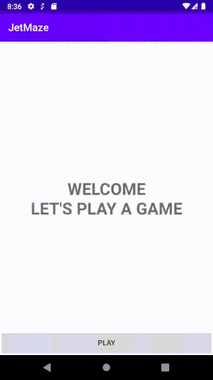
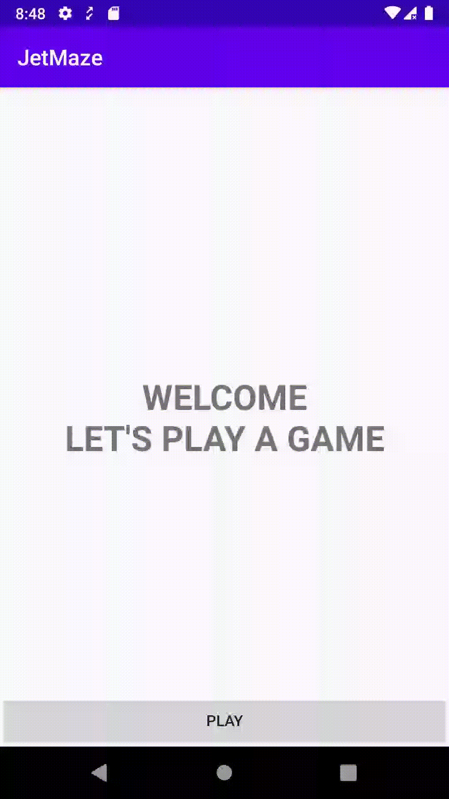
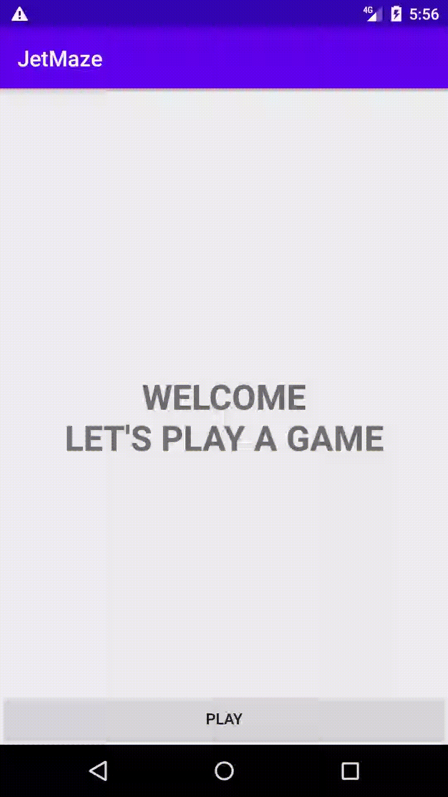
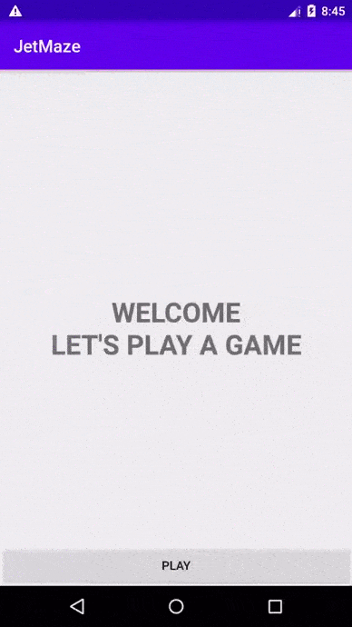
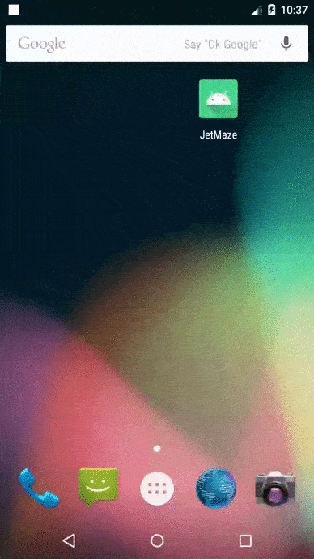

## Introduction

This app is a sample app to test Jetpack Navigation.

There are three main screens/fragments:
* HomeFragment (start destination)
* GameFragment (contains child fragment, MazeChildFragment)
* FinishFragment (arguments: isWin)

The navigation graph for these fragments are defined in `app/res/navigation/main_nav_graph.xml`.

The GameFragment in turn uses child fragments to show different steps taken in the maze.
The navigation graph for these fragments are defined in `app/res/navigation/maze_nav_graph.xml`

Another navigation graph (located at `app/res/navigation/nested_main_nav_graph.xml`) has also been created to understand how navigation graphs can be used to clean up code.




## Recordings

### Main Navigation Graph Behaviour

* **Forward**: Home -> Game -> Finish (argument: `isWin=false`)
* **Backward**: Finish -> Home

By defining the `app:popUpTo` in `main_nav_graph.xml`, fragments in the backstack that should not be shown (For example, `GameFragment`) can be popped on back press (from `FinishFragment`).

```
<action
    android:id="@+id/action_quit_game"
    app:destination="@id/nested_finish"
    app:popUpTo="@id/homeFragment" />

```



### Two Navigation Graphs (Parent & Child)

* **Forward**: Home -> Game (Maze Step A -> Maze Step B -> ....) -> Finish
* **Backward**: Finish -> Home

By defining two navigation graphs and referencing them separately in the `GameFragment`, we can control the navigation of child fragments alongside parent fragments.

```
mazeNavController = childFragmentManager.findFragmentById(R.id.child_nav_host).let {
    (it as NavHostFragment).navController
}
mainNavController = Navigation.findNavController(requireActivity(), R.id.main_nav_host)
```

Note: While there may be multiple navigation graphs, there can only be one default NavHost which is responsible for the default backstack.



### Custom Backpress and Backstack (Parent in sync with Child)

* **Forward:** Home -> Game (Maze Step A -> Maze Step B -> ....)
* **Backward:** Game (... -> Maze Step B -> Maze Step A) -> Home

This was possible only by overriding the BackPress. Check `GameFragment` for how backpress was configured.
```
requireActivity().onBackPressedDispatcher.addCallback(this, isEnabled=true) {
    // perform custom backstack operation
    isEnabled = false // set to false to reactivate the default backpress behaviour
}
```

One particularly tricky item was dealing with mandatory `startDestination`. In `maze_nav_graph.xml`, the `MazeChildFragment` requires arguments provided programatically. However, Jetpack Navigation will load the startDestination fragment with default arguments which creates an invalid state. This was resolved using a hack - ignoring the first fragment added (check `PlaceholderFragment`) and navigating to the relevant fragment (`MazeChildFragment`) once loaded. Also, now that there is one extra fragment in the backstack (`PlaceholderFragment`), it's also important to track this extra fragment in the navigation graph (handled in `GameFragment`) to ensure a consistent experience when using Backpress.


### Custom transitions

* **Path 1:** Home -(action)-> Game -(pop)-> Home
* **Path 2:** Home -(action)-> Game -(action)-> Finish -(pop)-> Home
* **Path 3:** Home -(action)-> Game -(action)-> Finish -(action)> Home

These are defined in the navigation graphs via
```
app:enterAnim="@anim/enter_from_right"
app:exitAnim="@anim/exit_to_left"
app:popEnterAnim="@anim/enter_from_left"
app:popExitAnim="@anim/exit_to_right"
```



### Deeplinks

#### Default behaviour:

Deeplink -> Share -(pop)-> Finish -(pop)-> Home

This follows the path defined in `main_nav_graph.xml` (Home-> Game -> Finish -> Share). Normally, that's convenient but it sets the default values for the arguments of previous fragments (eg: `FinishFragment` is set `isWin=false`). This can be a problem if the Share Screen is only meant to be opened during a win (or a deeplink that acts as a cheat code to reach the end)


#### Customised with arguments and overriden Backpress:

Deeplink -> Share -(pop)-> Home

The backpress of `ShareFragment` is overriden here with the instruction to pop the backstack up to the `HomeFragment` thereby skipping the screens in between where the default arguments are incorrect.




## Other Experiments

**Forward Navigation**

<details>
<summary>Can fragments be added over fragments (as in fragmentManager.add() instead of `replace()`)</summary>

The fragmentManager can be used alongside Jetpack Navgigation to support adding fragments.

However, Jetpack navigation can only support the replace() behaviour.  
</details>

<details>
<summary>Does navigation graphs support opening fragment A from fragment A?</summary>

Yes. Check `maze_nav_graph.xml` and you will see that the `MazeChildFragment` has an action to navigate to another instance of itself.
</details>

<details>
<summary>Is there a way to skip the start destination in the navigation graph? Can the fragment defined in the start destination be provided arguments programatically?</summary>

No. It seems that navigation graphs must have the property `app:startDestination` defined. And the fragment set as the start destination will use default values for its arguments.

This may cause issues if the fragment depends on arguments that are decided dynamically, in this example, the argument needed is the starting position of the Maze (`GameFragment`)
</details>

<details>
<summary>Can the app support multiple navigation graphs</summary>

Yes.

One, if child fragments are used, then the same screen can rely on multiple navigation graphs. For example, `GameFragment` uses two `NavControllers`, one to navigate through the child fragments (`maze_nav_graph`) and one to navigate the parent fragments (`main_nav_graph`).

However, there can only be one default nav graph (`app:defaultNavHost`) which handles the default backstack. Though the backpress can be overriden for custom backstacks.

Two, we can support nested navigation graphs. This is useful when the app has far too many screens and multiple files can help improve the readability of the code. However, this is only an extension of the same navigation graph.

</details>

<br/>

**Custom Backstack**

<details>
<summary>Can actions be defined such that select fragments on the stack be cleared?</summary>

Yes, check `FinishFragment` in `main_nav_graph.xml`. There is an action with properties set to return the user to home which pops all fragments from the `HomeFragment`.

**Forward path**: HomeFragment -> GameFragment -> FinishFragment

**Back path**: FinishFragment -> HomeFragment -> [exit app]

Notice that the back path does not include the GameFragment.

</details>


<details>
<summary>If a page uses multiple navigation graphs, can we change the default nav host to select whose backstack the app should follow</summary>

No. There can only be one default nav graph (`app:defaultNavHost`) which decides the default backstack based on the one navigation graph selected.

 Without overriding the backpress behaviour, the backstack of the `MazeChildFragment` would have been ignored and the flow would have been:

**Forward path**: HomeFragment -> GameFragment (MazeChildFragment A -> MazeChildFragment B -> MazeChildFragment C)

**Back path**: GameFragment (MazeChildFragment C)-> HomeFragment

However, the backpress can be configured to handle custom backstacks as done on `GameFragment`.

**Back path**: GameFragment (MazeChildFragment C -> MazeChildFragment B -> MazeChildFragment A) ->  HomeFragment
</details>


<details>
<summary>Can the backpress of a fragment include the backstack of its child fragments? </summary>

Yes, check `GameFragment`. You can override the backpress to pop the backstack of the child fragments before popping the backstack of the parent fragments.
</details>
